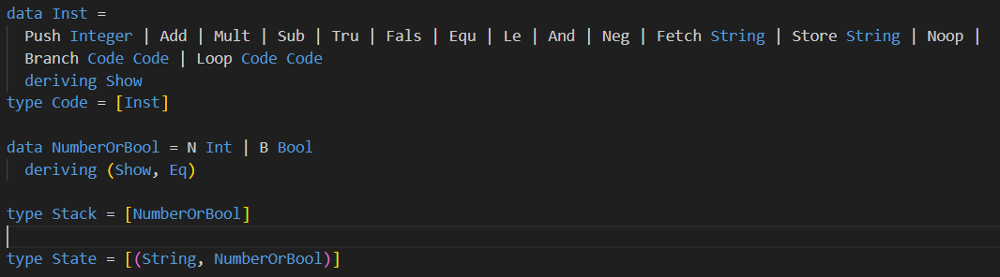
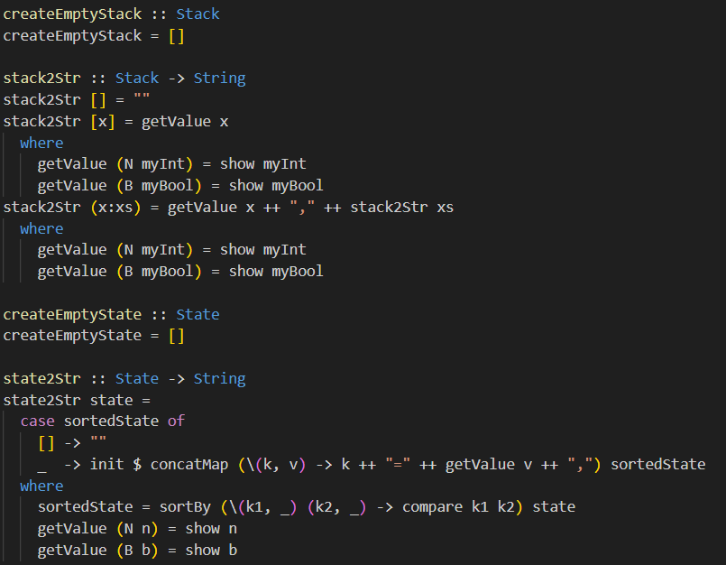
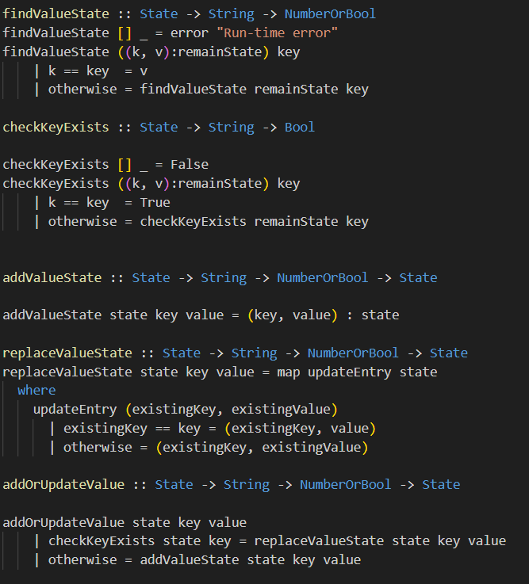
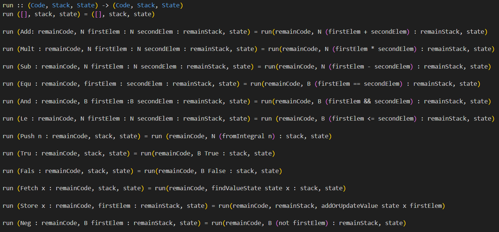
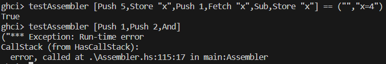
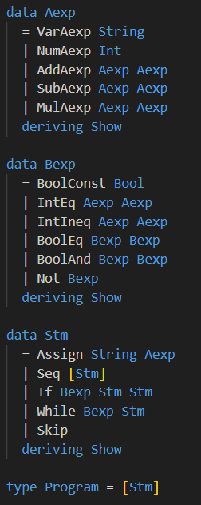
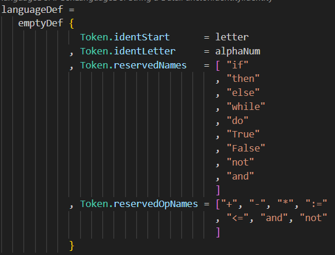
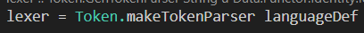
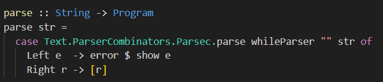
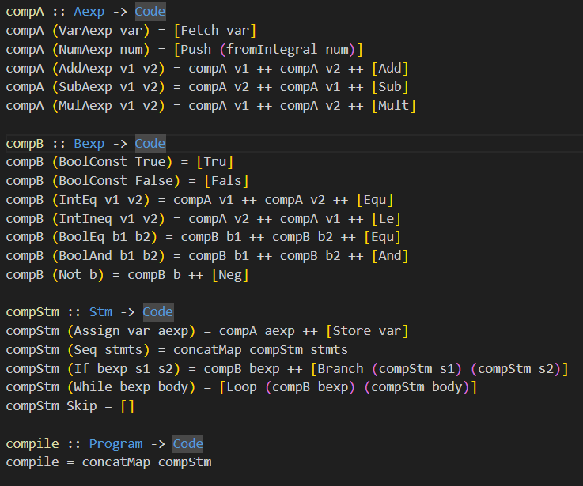

# Second Project

## Group T09_G07
- Davide Pinto Teixeira - up202109860 - 50%
- Maria Abreu da Costa - up202108849 - 50%

## Instalation and Execution
To run the project, download the PFL_TP2_T09_G07.zip file and unzip it. Inside the 'src' directory, use the following commands to compile the code:

```
ghc -package parsec main.hs
./main
```

When in the ghci:

```
:set -package parsec
:l main.hs
```

## Project's Description and Implementation

### First Part
In the initial phase of the project, we were tasked with defining and implementing various components of a low-level machine along with its interpreter. This machine operates on an instruction set, evaluation stack, and storage. The instruction set encompasses arithmetic and boolean operations. Additionally, we implemented instructions that facilitate modifications to the stack and control flow, such as loops and branches.

#### Implementation
To facilitate the implementation, we began by defining essential data types. The NumberOrBool type was introduced to represent values that could be either boolean or integer. Additionally, the Stack type was established as a list composed of elements with the NumberOrBool type. Finally, the State type was defined as a list of pairs, each consisting of a string and its associated NumberOrBool value.
Subsequently, we developed several essential functions to manage the state and stack components.

<p align="center">
  
</p>

These included functions to create an empty stack (createEmptyStack) and an empty state (createEmptyState). Additionally, functions like stack2Str and state2Str were implemented to convert the stack and state to strings, respectively. For effective value manipulation, functions such as findValueState and checkKeyExists were introduced to retrieve values associated with variables and check the existence of variables in the state, respectively. Furthermore, functions to add pairs to the state (addValueState), replace a value in the state (replaceValueState), and add or update values in the state (addOrUpdateValue) were also defined.

<p align="center">
  
</p>

<p align="center">
  
</p>

Finally, the interpreter (run function) was designed to process a list of instructions, ensuring the stack and state were updated appropriately. This function handles the operations specified in the project description. It returns the modified code, stack, and state. In the event of an error, the function raises a runtime error.

<p align="center">
  
</p>

<p align="center">
  
</p>


### Second Part
In the final phase of the project, we implemented the compiler to convert statements into machine instructions. Additionally, the parser was developed to facilitate the transformation of imperative programs, represented as strings, into a structured representation utilizing the defined data types.

#### Implementation
Initially, we established data types to represent arithmetic expressions (Aexp), boolean expressions (Bexp), and statements (Stm).

<p align="center">
  
</p>

Following that, we defined the lexer (lexer). This module is tasked with breaking down the input string into individual tokens, facilitating the parsing process.

<p align="center">
  
</p>

<p align="center">
  
</p>

Subsquently, we formulated the parser functions designed to parse distinct statements and operations, which lead to the creation of the primary parser function (parse).

<p align="center">
  
</p>

Finally, we defined the compilers which are responsible to handle the translation of statements (compStm) and arithmetic (compA) and boolean (compB) expressions into the machine instructions, as mentioned in the project's description.

<p align="center">
  
</p>


## Conclusions
In this project, we successfully designed a compiler. We began with the development of a lexer, followed by parsing, and concluding with code generation for machine instructions. The main challenge lay in formulating an effective lexer to facilitate subsequent parsing of instructions. Overall, the project provided a better understanding of the concepts covered in class.
